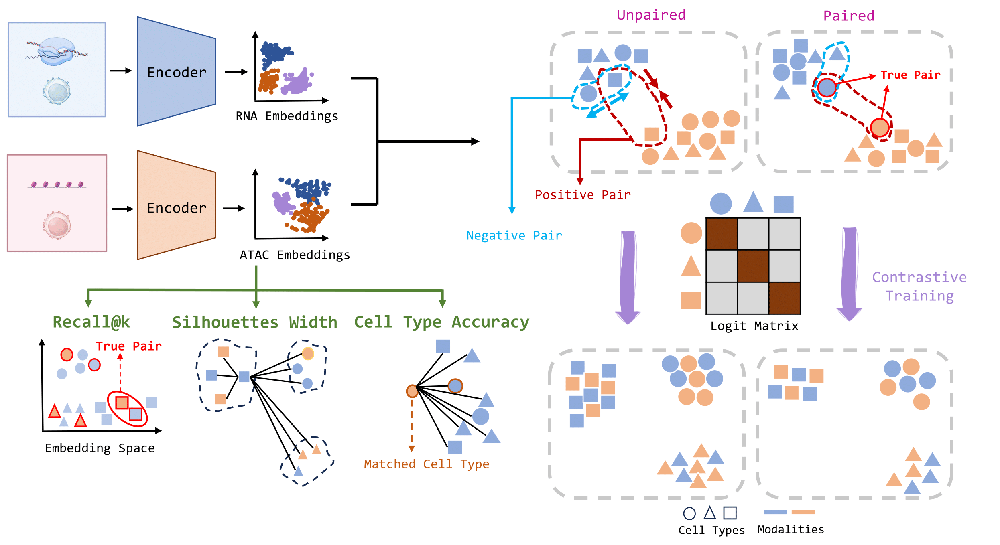

# Single-cell Contrastive INtegration (sCIN)

sCIN is a neural network framework based on Constrastive Learning for single-cell multi-omics data integration.


Preprint: https://www.biorxiv.org/content/10.1101/2025.02.03.636095v2

_sCIN codebsae is currently undergoing major revisions and refactorings, so some files are deleted or changed. The tutorial will be updated soon._

## Installation

To install `sCIN`, first clone the repository by running the following command in terminal:
```
git clone https://github.com/AmirTEbi/sCIN.git
```
Then:
```
cd sCIN
poetry install sCIN
```
Note that [Poetry](https://python-poetry.org/docs/#installation) should be installed on your system or you can install dependencies directly from `requirements.txt` by:
```
pip install -r requirements.txt
```

For tutorial on how to use sCIN and suggestions please refer to `guide` directory. 